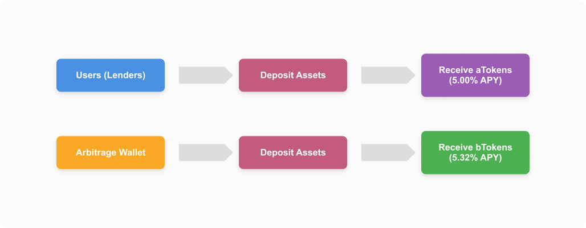

# Portal Trade Contract

[](https://opensource.org/licenses/MIT)

Portal Trade Contract is a decentralized lending and arbitrage trading protocol leveraging cutting-edge blockchain technology. This project provides a smart contract system that allows users to deposit assets, borrow funds, and generate profits through arbitrage trading.

<p align="center">
  
</p>

## Key Features

- **Asset Supply**: Users can deposit assets to receive aTokens and earn interest
- **Arbitrage Trading**: Designated arbitrage wallets can perform arbitrage operations using bTokens
- **Flexible Lending System**: Configurable Loan-to-Value (LTV) ratios and liquidation thresholds
- **Multi-Asset Support**: Compatible with various ERC20 tokens
- **Yield Optimization**: Automatically maximize returns through efficient capital allocation

## Architecture

The Portal Trade Contract system uses a modular architecture with the following components:

```
Portal Trade Contract
├── Core Contracts
│   ├── Pool.sol            # Main entry point for all operations
│   ├── AToken.sol          # Tokenized deposit (yield-bearing tokens)
│   └── BToken.sol          # Tokenized arbitrage positions
├── Libraries
│   ├── DataTypes.sol       # Shared data structures
│   └── ValidationLogic.sol # Input validation logic
└── Interfaces
    ├── IPool.sol           # Pool interface
    ├── IAToken.sol         # AToken interface
    └── IBToken.sol         # BToken interface
```

### System Flow

1. Users deposit assets into the Pool contract
2. Pool mints aTokens to represent user deposits
3. Arbitrage wallets provide arbitrage liquidity and receive bTokens
4. Yield is distributed to both aToken and bToken holders based on protocol parameters

## Technology Stack

- Solidity 0.8.x
- Hardhat
- TypeScript
- OpenZeppelin Contracts
- Ethers.js

## Installation

```bash
# Clone the repository
git clone https://github.com/your-username/Portal-Trade-Contract.git
cd Portal-Trade-Contract

# Install dependencies
npm install
```

## Usage

### Compile Contracts

```bash
npx hardhat compile
```

### Run Tests

```bash
npx hardhat test
```

### Deploy to Local Node

```bash
npx hardhat node
npx hardhat ignition deploy ./ignition/modules/Pool.js --network localhost
```

## Development Artifacts

After compilation, the following artifacts will be generated:

```
artifacts/
├── build-info/                # Build metadata
├── contracts/
│   ├── Pool.sol/              # Pool contract artifacts
│   │   ├── Pool.json          # ABI and bytecode
│   │   └── Pool.dbg.json      # Debug information
│   ├── tokens/
│   │   ├── AToken.sol/        # AToken contract artifacts
│   │   └── BToken.sol/        # BToken contract artifacts
│   └── ...
└── hardhat/                   # Hardhat-specific artifacts
```

The generated ABIs can be used to interact with the deployed contracts from frontend applications or scripts.

## Contract Structure

- **Pool.sol**: Main contract managing deposits, withdrawals, borrows, and repayments
- **AToken.sol**: Tokenized representation of deposited assets
- **BToken.sol**: Tokenized representation for arbitrage positions

## License

This project is licensed under the MIT License - see the [LICENSE](LICENSE) file for details.

## Contributing

1. Fork the project
2. Create your feature branch (`git checkout -b feature/amazing-feature`)
3. Commit your changes (`git commit -m 'Add some amazing feature'`)
4. Push to the branch (`git push origin feature/amazing-feature`)
5. Open a Pull Request

## Contact

Project Maintainer - [@your-twitter](https://twitter.com/your-twitter) - email@example.com

Project Link: [https://github.com/your-username/Portal-Trade-Contract](https://github.com/your-username/Portal-Trade-Contract)
